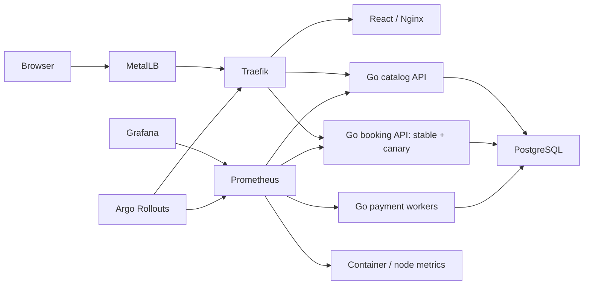
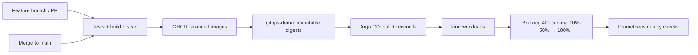

# Ticket Platform

A small ticket-booking application with a complete local Kubernetes delivery story. Browse events, reserve tickets, and watch a simulated payment move your order from **pending** to **confirmed** or **failed**.

The application is deliberately small. The project demonstrates scheduling, bounded autoscaling, network isolation, durable jobs, resource monitoring, GitOps reconciliation, and metric-driven canary releases.

## Architecture



Four application workloads share a Go module and a PostgreSQL database. The backend container runs a different command for each service. Reservations and payment jobs commit in one transaction; leased workers process jobs without a separate message broker. PostgreSQL roles separate catalog reads, booking writes, and worker updates.

## Get started

Requirements: Linux with Docker Engine access, approximately 8 GB available RAM, Go 1.26+, Node 24+, Python 3 with PyYAML 6.0.3, `curl`, `jq`, and `rg`. `make tools` installs missing kind, kubectl, and Helm binaries under `.local/bin`; it never changes system packages. All infrastructure versions are pinned in [versions.env](versions.env).

```bash
git clone https://github.com/wmcbay13/ticket-platform.git
cd ticket-platform
npm ci --prefix web
make tools
make test
make integration
make bootstrap
make status
make smoke
```

The repository must have a published `gitops-demo` branch and publicly pullable GHCR packages before bootstrap can finish. The release workflow creates the branch after its checks pass. First-time maintainers must enable **public** visibility for the backend and web packages in GitHub package settings; a public repository does not automatically make GHCR images public.

Bootstrap creates `ticket-platform` with one control-plane and two workers. It installs Cilium and Argo CD from the same pinned values that Argo CD subsequently manages, creates local credentials, and applies the root Argo application. Argo CD installs the remaining components. Bootstrap then configures a MetalLB address pool from the actual Docker subnet. The pool, credentials, kubeconfig, caches, and PostgreSQL data live under ignored `.local/`.

Open the application URL printed by `make status`. The MetalLB IP is reachable from the Linux host. No public DNS or internet-facing listener is configured.

```bash
make grafana-ui       # http://localhost:3000 — admin; password in .local/credentials.json
make argocd-ui        # http://localhost:8085 — admin
make argocd-password  # print Argo CD's initial password explicitly
```

Dashboards include **Ticket Platform — Operations** and the Kubernetes container/resource dashboards bundled with kube-prometheus-stack. Metrics Server supplies HPA metrics; Prometheus supplies dashboards and canary analysis.

## GitOps delivery



- PRs validate code and images. Fork PRs cannot publish or promote.
- A successful push to `main` publishes the exact scanned images and updates `gitops-demo` with digests and `release.json` source provenance. Superseded builds do not promote.
- Initial feature-branch deployment is enabled only by repository variable `PREVIEW_DEPLOY_ENABLED=true`. Disable it before preparing the final PR.
- GitHub Actions holds no kubeconfig and cannot reach the local cluster. Argo CD polls Git and performs the deployment.
- The booking API uses Argo Rollouts and Traefik weighted services. At 10% and 50%, three measurements require at least 100 canary requests in the preceding two minutes, 5xx fraction at most 1%, and p95 latency at most 500 ms. Missing samples produce an inconclusive analysis and pause promotion. Run `make canary-traffic` during a release.
- Failed analysis returns traffic to stable pods. It leaves the failed desired version visible in Git and Argo; repair desired state by reverting the deployment commit. Controller-owned weights, selectors, and HPA replica counts are excluded from reconciliation.

## Demonstrations

See the step-by-step [demo runbook](docs/runbook.md).

| Command | Demonstration |
| --- | --- |
| `make smoke` | Success, decline, retry, and duplicate-safe reservations |
| `make load` | Traffic ramp from 20 to 500 requests/sec; HPA scaling and resource graphs |
| `make failure-pod` | Kubernetes replaces a catalog pod |
| `make failure-database-pod` | Restart PostgreSQL and verify order/inventory persistence |
| `make failure-worker-node` | Stop the stateless worker node, verify recovery, then restore it |
| `make policy-test` | Authorized database traffic succeeds; unauthorized API/database traffic fails |
| `make drift-demo` | Argo CD repairs a live CPU-request change |
| `make canary-good` | Publish a healthy booking template revision |
| `make canary-fail` | Publish an intentionally failing booking canary |
| `make canary-traffic` | Generate booking traffic for analysis (ten minutes by default) |
| `make canary-restore` | Restore the canonical booking template after demos |

Load summaries are saved under `.local/results/`. The load scenario checks fewer than 1% failed requests and p95 below 500 ms; these are demo acceptance targets, not hardware-independent capacity claims. See [validation evidence](docs/validation.md) for measured results.


## Application contract and limitations

See [API documentation](docs/api.md), [failure model](docs/failure-model.md), and [troubleshooting](docs/troubleshooting.md).

This version uses guest bookings, opaque order URLs, event quantities rather than seat assignments, and simulated payments. It has no accounts or real payment integration. kind nodes share one host and kernel. Autoscaling adds pods within fixed local capacity; it does not provision machines. PostgreSQL is single-instance and its volume is tied to the first worker. The node-failure demo targets the other worker. Cluster/controller failure and database failover are outside the demo's availability guarantee.

`make teardown` removes the named cluster and retains `.local/data` and credentials. Preserve both together to reuse the database. Deleting the data directory is an explicit reset and is not part of teardown.
