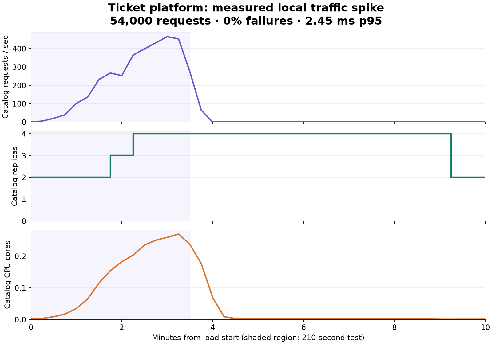

# Validation evidence

Measured on October 1, 2026, on a Linux host with 8 logical CPUs and 16 GB RAM. kind runs one control-plane and two worker containers on this shared host. These results describe this local demo, rather than production capacity or host-level high availability.

- Backend unit tests and Go race checks passed.
- PostgreSQL integration tests passed: 80 concurrent reservations accepted exactly 20 tickets; 40 concurrent duplicate requests created one order; stale leases could not complete; repeated failures did not release inventory twice; transaction rollback restored inventory and removed the partial order.
- Frontend TypeScript build and API tests passed.
- Full npm dependency audit reports zero vulnerabilities after updating Vite/Vitest.
- Kustomize rendering and YAML syntax checks passed.
- All seven pinned Helm charts rendered successfully against their current values schemas. CI also validates native Kubernetes resource schemas and checks that generated manifests are committed.
- Both final images passed the CI Trivy gate for fixed HIGH/CRITICAL vulnerabilities. Both GHCR packages were pulled anonymously from the host and by the cluster.
- Canary PromQL regression tests passed with the real Prometheus `promtool`: healthy responses return 1, entirely failing responses return 0, and insufficient, zero, or absent traffic produces no eligible result. Run `make analysis-test` to repeat these cases.

The integration suite uses an isolated, disposable PostgreSQL container. It does not run against the demo's persistent database.

The final placement configuration passed [the source pipeline](https://github.com/wmcbay13/ticket-platform/actions/runs/36878395401) and [PR checks](https://github.com/wmcbay13/ticket-platform/actions/runs/36878398288). The final deployment snapshot records source commit `2c261da`; later feature commits add documentation/evidence with preview promotion disabled. See the PR for checks on its final commit.

## Live application and infrastructure

The three kind nodes were Ready. Cilium, Argo CD, MetalLB, Metrics Server, kube-prometheus-stack, Argo Rollouts, Traefik, and the ticket application reconciled successfully. Backend pods were scraped by Prometheus, container CPU metrics were present, and Grafana's API reported the provisioned **Ticket Platform — Operations** dashboard.

After the final scheduling rollout, each application workload had one replica on each worker. Spreading is scoped to the revision hash, so older pods do not distort placement. The worker-node recovery check was repeated with this configuration; replacements could still run on the surviving worker. [Recorded placement and rollout results](evidence/placement.json).

After restoring the node, demo cleanup replaced one pod per workload to return to balanced placement. Existing survivor pods would otherwise remain in place until their next rollout or replacement.

External requests went through the MetalLB address and Traefik. Automated smoke checks verified pending → confirmed, pending → failed, and retry → confirmed. Replaying each reservation's idempotency key returned the original order. Final smoke checks passed again after recovery tests.

Browser visual QA and screenshots were omitted at the user's request. The frontend passed TypeScript build, API tests, and dependency audit; live validation covers HTTP/API and infrastructure behavior.

## Traffic spike

`make load` used the 210-second arrival-rate ramp from 20 to 300 to 500 and back to 20 requests/sec against the catalog API. This test measures catalog reads; it does not establish checkout/payment throughput.

| Measurement | Observed result |
| --- | --- |
| Completed requests | 54,000, matching the planned ramp |
| Average achieved request rate | 257.14 requests/sec over the full run |
| Failed requests / failed checks | 0 / 0 |
| Client p95 latency | 2.45 ms |
| Maximum client latency | 138.34 ms |
| Interrupted iterations | 0 |
| Catalog replicas | 2 → 3 → 4 → 2 |
| Resource bounds | Each API pod requests 50m CPU / 64 MiB; limits 500m / 128 MiB |

All acceptance thresholds passed. HPA returned to two replicas after its scale-down stabilization window. Prometheus measures a moving request rate, so its graph smooths the instantaneous k6 arrival target.



[Underlying measured data and k6 summary](evidence/spike.json). The chart uses 15-second query steps and a start time derived from the k6 summary write time and measured run duration. Regenerate it while the metrics are retained:

```bash
# In a separate terminal, expose Prometheus locally.
KUBECONFIG=$PWD/.local/kubeconfig kubectl --context kind-ticket-platform \
  -n monitoring port-forward svc/monitoring-kube-prometheus-prometheus 9090:9090

python3 -m venv .local/evidence-venv
.local/evidence-venv/bin/pip install matplotlib==3.11.2
.local/evidence-venv/bin/python scripts/plot-evidence.py \
  .local/results/spike-20261001T133006Z.json --start 2026-10-01T13:30:13.335037Z
```

## Recovery and isolation

| Demonstration | Verified outcome |
| --- | --- |
| Catalog pod deletion | Replacement became Ready; all booking smoke scenarios passed |
| Stateless worker-node stop | Application replacements ran on the surviving worker after the 90-second detection/eviction wait; smoke checks passed before the stopped node was restored |
| PostgreSQL pod restart | A confirmed order and its inventory count were preserved |
| Cilium isolation | A permitted migration-label probe connected to PostgreSQL; an unrelated probe could reach neither PostgreSQL nor catalog |
| GitOps drift repair | A live catalog CPU-request change from 50m to 500m was restored to 50m by Argo CD |
| Repeated bootstrap | Existing credentials/data retained; infrastructure and application remained healthy |

[Recorded recovery command output](evidence/recovery.txt). Node recovery demonstrates application rescheduling within one surviving kind worker. It does not demonstrate database node failover, host survival, or uninterrupted requests during node detection.

## Canary promotion and abort

The corrected healthy source release passed both 10% and 50% analyses with three successful samples per metric and then reached 100%. Measured canary success rate was 1.0 and histogram-derived p95 was approximately 4.75 ms, below the 500 ms gate.

The intentional all-503 revision failed its first success-rate measurement with value 0. Rollouts set `abort=true`, reported `RolloutAborted`, and changed Traefik routing to **100% stable / 0% canary**. Restoring the canonical template through `gitops-demo` returned the rollout to Healthy. Missing traffic still produces an inconclusive result instead of promotion.

[Recorded AnalysisRun results and routing weights](evidence/canary.json). Preview promotion is disabled before final review; pushes to `main` retain automatic digest promotion after merge.
